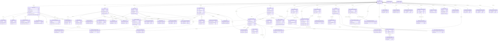

```mermaid
erDiagram
    REALM {
        string ID PK
        string NAME
    }
    USER_ENTITY {
        string ID PK
        string REALM_ID FK
        string USERNAME
        string EMAIL
        string FEDERATION_LINK
        string SERVICE_ACCOUNT_CLIENT_LINK
    }
    CLIENT {
        string ID PK
        string REALM_ID FK
        string CLIENT_ID
        string PROTOCOL
    }
    CLIENT_SCOPE {
        string ID PK
        string REALM_ID FK
        string NAME
        string PROTOCOL
    }
    KEYCLOAK_ROLE {
        string ID PK
        string REALM_ID FK
        string CLIENT FK
        string NAME
        boolean CLIENT_ROLE
    }
    KEYCLOAK_GROUP {
        string ID PK
        string REALM_ID FK
        string PARENT_GROUP FK
        string ORG_ID FK
        string NAME
    }
    ORG {
        string ID PK
        string REALM_ID FK
        string GROUP_ID FK
        string NAME
        string ALIAS
    }
    IDENTITY_PROVIDER {
        string INTERNAL_ID PK
        string REALM_ID FK
        string PROVIDER_ALIAS
        string ORGANIZATION_ID FK
    }
    AUTHENTICATION_FLOW {
        string ID PK
        string REALM_ID FK
        string ALIAS
    }
    AUTHENTICATION_EXECUTION {
        string ID PK
        string REALM_ID FK
        string FLOW_ID FK
        string AUTH_CONFIG FK
        string AUTH_FLOW_ID FK
    }
    AUTHENTICATOR_CONFIG {
        string ID PK
        string REALM_ID FK
        string ALIAS
    }
    COMPONENT {
        string ID PK
        string REALM_ID FK
        string PARENT_ID FK
        string PROVIDER_ID
    }
    USER_FEDERATION_PROVIDER {
        string ID PK
        string REALM_ID FK
        string PROVIDER_NAME
    }
    USER_FEDERATION_MAPPER {
        string ID PK
        string REALM_ID FK
        string FEDERATION_PROVIDER_ID FK
    }
    PROTOCOL_MAPPER {
        string ID PK
        string CLIENT_ID FK
        string CLIENT_SCOPE_ID FK
        string PROTOCOL
    }

    USER_ATTRIBUTE {
        string ID PK
        string USER_ID FK
        string NAME
    }
    CREDENTIAL {
        string ID PK
        string USER_ID FK
        string TYPE
    }
    FEDERATED_IDENTITY {
        string USER_ID PK,FK
        string IDENTITY_PROVIDER PK
        string FEDERATED_USER_ID
    }
    USER_REQUIRED_ACTION {
        string USER_ID PK,FK
        string REQUIRED_ACTION PK
    }
    USER_ROLE_MAPPING {
        string USER_ID PK,FK
        string ROLE_ID PK,FK
    }
    USER_GROUP_MEMBERSHIP {
        string USER_ID PK,FK
        string GROUP_ID PK,FK
    }
    USER_CONSENT {
        string ID PK
        string USER_ID FK
        string CLIENT_ID FK
    }
    USER_CONSENT_CLIENT_SCOPE {
        string USER_CONSENT_ID PK,FK
        string SCOPE_ID PK,FK
    }
    USER_VER_CREDENTIAL {
        string ID PK
        string USER_ID FK
        string CREDENTIAL_SCOPE_NAME
    }

    CLIENT_ATTRIBUTES {
        string CLIENT_ID PK,FK
        string NAME PK
        string VALUE
    }
    CLIENT_SCOPE_CLIENT {
        string CLIENT_ID PK,FK
        string SCOPE_ID PK,FK
        boolean DEFAULT_SCOPE
    }
    CLIENT_SCOPE_ATTRIBUTES {
        string SCOPE_ID PK,FK
        string NAME PK
    }
    CLIENT_SCOPE_ROLE_MAPPING {
        string SCOPE_ID PK,FK
        string ROLE_ID PK,FK
    }
    SCOPE_MAPPING {
        string CLIENT_ID PK,FK
        string ROLE_ID PK,FK
    }

    ROLE_ATTRIBUTE {
        string ID PK
        string ROLE_ID FK
        string NAME
    }
    COMPOSITE_ROLE {
        string COMPOSITE PK,FK
        string CHILD_ROLE PK,FK
    }
    GROUP_ATTRIBUTE {
        string ID PK
        string GROUP_ID FK
        string NAME
    }
    GROUP_ROLE_MAPPING {
        string GROUP_ID PK,FK
        string ROLE_ID PK,FK
    }
    ORG_DOMAIN {
        string ID PK
        string ORG_ID FK
        string NAME
    }
    ORG_INVITATION {
        string ID PK
        string ORGANIZATION_ID FK
        string EMAIL
    }
    IDENTITY_PROVIDER_MAPPER {
        string ID PK
        string REALM_ID FK
        string IDP_ALIAS FK
    }
    REALM_ATTRIBUTE {
        string REALM_ID PK,FK
        string NAME PK
    }
    REALM_LOCALIZATIONS {
        string REALM_ID PK,FK
        string LOCALE PK
    }
    REALM_REQUIRED_CREDENTIAL {
        string REALM_ID PK,FK
        string TYPE PK
    }
    REQUIRED_ACTION_PROVIDER {
        string ID PK
        string REALM_ID FK
        string ALIAS
    }
    CLIENT_INITIAL_ACCESS {
        string ID PK
        string REALM_ID FK
    }
    COMPONENT_CONFIG {
        string ID PK
        string COMPONENT_ID FK
        string NAME
    }

    REALM_SMTP_CONFIG {
        string REALM_ID PK,FK
        string NAME PK
    }
    REALM_DEFAULT_GROUPS {
        string REALM_ID PK,FK
        string GROUP_ID PK,FK
    }
    REALM_EVENTS_LISTENERS {
        string REALM_ID PK,FK
        string VALUE PK
    }
    REALM_ENABLED_EVENT_TYPES {
        string REALM_ID PK,FK
        string VALUE PK
    }
    REALM_SUPPORTED_LOCALES {
        string REALM_ID PK,FK
        string VALUE PK
    }
    IDENTITY_PROVIDER_CONFIG {
        string IDENTITY_PROVIDER_ID PK,FK
        string NAME PK
    }
    IDP_MAPPER_CONFIG {
        string IDP_MAPPER_ID PK,FK
        string NAME PK
    }
    AUTHENTICATOR_CONFIG_ENTRY {
        string AUTHENTICATOR_ID PK,FK
        string NAME PK
    }
    REQUIRED_ACTION_CONFIG {
        string REQUIRED_ACTION_ID PK,FK
        string NAME PK
    }
    PROTOCOL_MAPPER_CONFIG {
        string PROTOCOL_MAPPER_ID PK,FK
        string NAME PK
    }
    WEB_ORIGINS {
        string CLIENT_ID PK,FK
        string VALUE PK
    }
    REDIRECT_URIS {
        string CLIENT_ID PK,FK
        string VALUE PK
    }
    CLIENT_AUTH_FLOW_BINDINGS {
        string CLIENT_ID PK,FK
        string BINDING_NAME PK
        string FLOW_ID FK
    }
    CLIENT_NODE_REGISTRATIONS {
        string CLIENT_ID PK,FK
        string NAME PK
    }
    USER_FEDERATION_CONFIG {
        string USER_FEDERATION_PROVIDER_ID PK,FK
        string NAME PK
    }
    USER_FEDERATION_MAPPER_CONFIG {
        string USER_FEDERATION_MAPPER_ID PK,FK
        string NAME PK
    }

    MIGRATION_MODEL {
        string ID PK
    }
    REVOKED_TOKEN {
        string ID PK
    }
    OUTBOX_ENTRY {
        string ID PK
        string REALM_ID FK
        string OWNER_ID
        string ENTRY_KIND
    }

    REALM ||--o{ USER_ENTITY : REALM_ID
    REALM ||--o{ CLIENT : REALM_ID
    REALM ||--o{ CLIENT_SCOPE : REALM_ID
    REALM ||--o{ KEYCLOAK_ROLE : REALM_ID
    REALM ||--o{ KEYCLOAK_GROUP : REALM_ID
    REALM ||--o{ ORG : REALM_ID
    REALM ||--o{ IDENTITY_PROVIDER : REALM_ID
    REALM ||--o{ AUTHENTICATION_FLOW : REALM_ID
    REALM ||--o{ AUTHENTICATION_EXECUTION : REALM_ID
    REALM ||--o{ AUTHENTICATOR_CONFIG : REALM_ID
    REALM ||--o{ COMPONENT : REALM_ID
    REALM ||--o{ USER_FEDERATION_PROVIDER : REALM_ID
    REALM ||--o{ USER_FEDERATION_MAPPER : REALM_ID
    REALM ||--o{ IDENTITY_PROVIDER_MAPPER : REALM_ID
    REALM ||--o{ REALM_ATTRIBUTE : REALM_ID
    REALM ||--o{ REALM_LOCALIZATIONS : REALM_ID
    REALM ||--o{ REALM_REQUIRED_CREDENTIAL : REALM_ID
    REALM ||--o{ REQUIRED_ACTION_PROVIDER : REALM_ID
    REALM ||--o{ CLIENT_INITIAL_ACCESS : REALM_ID
    REALM ||--o{ OUTBOX_ENTRY : REALM_ID

    USER_ENTITY ||--o{ USER_ATTRIBUTE : USER_ID
    USER_ENTITY ||--o{ CREDENTIAL : USER_ID
    USER_ENTITY ||--o{ FEDERATED_IDENTITY : USER_ID
    USER_ENTITY ||--o{ USER_REQUIRED_ACTION : USER_ID
    USER_ENTITY ||--o{ USER_ROLE_MAPPING : USER_ID
    USER_ENTITY ||--o{ USER_GROUP_MEMBERSHIP : USER_ID
    USER_ENTITY ||--o{ USER_CONSENT : USER_ID
    USER_ENTITY ||--o{ USER_VER_CREDENTIAL : USER_ID
    KEYCLOAK_ROLE ||--o{ USER_ROLE_MAPPING : ROLE_ID
    KEYCLOAK_GROUP ||--o{ USER_GROUP_MEMBERSHIP : GROUP_ID

    CLIENT ||--o{ CLIENT_ATTRIBUTES : CLIENT_ID
    CLIENT ||--o{ CLIENT_SCOPE_CLIENT : CLIENT_ID
    CLIENT_SCOPE ||--o{ CLIENT_SCOPE_CLIENT : SCOPE_ID
    CLIENT_SCOPE ||--o{ CLIENT_SCOPE_ATTRIBUTES : SCOPE_ID
    CLIENT_SCOPE ||--o{ CLIENT_SCOPE_ROLE_MAPPING : SCOPE_ID
    KEYCLOAK_ROLE ||--o{ CLIENT_SCOPE_ROLE_MAPPING : ROLE_ID
    CLIENT ||--o{ SCOPE_MAPPING : CLIENT_ID
    KEYCLOAK_ROLE ||--o{ SCOPE_MAPPING : ROLE_ID
    CLIENT ||--o{ PROTOCOL_MAPPER : CLIENT_ID
    CLIENT_SCOPE ||--o{ PROTOCOL_MAPPER : CLIENT_SCOPE_ID

    KEYCLOAK_ROLE ||--o{ ROLE_ATTRIBUTE : ROLE_ID
    KEYCLOAK_ROLE ||--o{ COMPOSITE_ROLE : COMPOSITE
    KEYCLOAK_ROLE ||--o{ COMPOSITE_ROLE : CHILD_ROLE
    KEYCLOAK_GROUP ||--o{ GROUP_ATTRIBUTE : GROUP_ID
    KEYCLOAK_GROUP ||--o{ GROUP_ROLE_MAPPING : GROUP_ID
    KEYCLOAK_ROLE ||--o{ GROUP_ROLE_MAPPING : ROLE_ID
    KEYCLOAK_GROUP ||--o{ KEYCLOAK_GROUP : PARENT_GROUP

    ORG ||--o{ ORG_DOMAIN : ORG_ID
    ORG ||--o{ KEYCLOAK_GROUP : ORG_ID
    ORG ||--o{ IDENTITY_PROVIDER : ORGANIZATION_ID
    ORG ||--o{ ORG_INVITATION : ORGANIZATION_ID
    AUTHENTICATION_FLOW ||--o{ AUTHENTICATION_EXECUTION : FLOW_ID
    AUTHENTICATION_FLOW ||--o{ AUTHENTICATION_EXECUTION : AUTH_FLOW_ID
    AUTHENTICATOR_CONFIG ||--o{ AUTHENTICATION_EXECUTION : AUTH_CONFIG
    COMPONENT ||--o{ COMPONENT_CONFIG : COMPONENT_ID
    COMPONENT ||--o{ COMPONENT : PARENT_ID
    USER_FEDERATION_PROVIDER ||--o{ USER_FEDERATION_MAPPER : FEDERATION_PROVIDER_ID
    IDENTITY_PROVIDER ||--o{ IDENTITY_PROVIDER_MAPPER : IDP_ALIAS

    USER_CONSENT ||--o{ USER_CONSENT_CLIENT_SCOPE : USER_CONSENT_ID
    CLIENT_SCOPE ||--o{ USER_CONSENT_CLIENT_SCOPE : SCOPE_ID
    CLIENT ||--o{ USER_CONSENT : CLIENT_ID

    REALM ||--o{ REALM_SMTP_CONFIG : REALM_ID
    REALM ||--o{ REALM_DEFAULT_GROUPS : REALM_ID
    KEYCLOAK_GROUP ||--o{ REALM_DEFAULT_GROUPS : GROUP_ID
    REALM ||--o{ REALM_EVENTS_LISTENERS : REALM_ID
    REALM ||--o{ REALM_ENABLED_EVENT_TYPES : REALM_ID
    REALM ||--o{ REALM_SUPPORTED_LOCALES : REALM_ID
    IDENTITY_PROVIDER ||--o{ IDENTITY_PROVIDER_CONFIG : IDENTITY_PROVIDER_ID
    IDENTITY_PROVIDER_MAPPER ||--o{ IDP_MAPPER_CONFIG : IDP_MAPPER_ID
    AUTHENTICATOR_CONFIG ||--o{ AUTHENTICATOR_CONFIG_ENTRY : AUTHENTICATOR_ID
    REQUIRED_ACTION_PROVIDER ||--o{ REQUIRED_ACTION_CONFIG : REQUIRED_ACTION_ID
    PROTOCOL_MAPPER ||--o{ PROTOCOL_MAPPER_CONFIG : PROTOCOL_MAPPER_ID
    CLIENT ||--o{ WEB_ORIGINS : CLIENT_ID
    CLIENT ||--o{ REDIRECT_URIS : CLIENT_ID
    CLIENT ||--o{ CLIENT_AUTH_FLOW_BINDINGS : CLIENT_ID
    AUTHENTICATION_FLOW ||--o{ CLIENT_AUTH_FLOW_BINDINGS : FLOW_ID
    CLIENT ||--o{ CLIENT_NODE_REGISTRATIONS : CLIENT_ID
    USER_FEDERATION_PROVIDER ||--o{ USER_FEDERATION_CONFIG : USER_FEDERATION_PROVIDER_ID
    USER_FEDERATION_MAPPER ||--o{ USER_FEDERATION_MAPPER_CONFIG : USER_FEDERATION_MAPPER_ID
```
