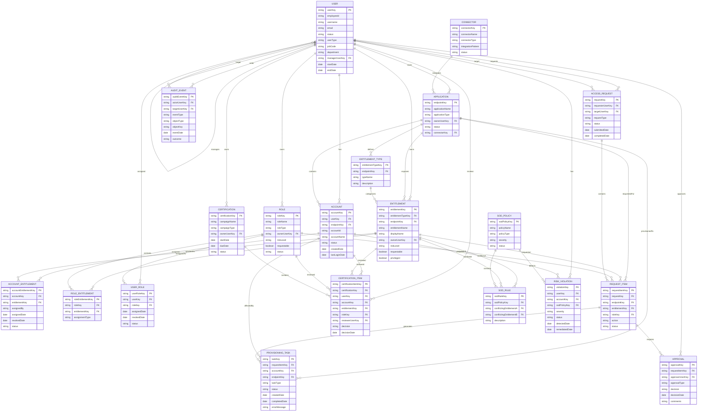

```mermaid
erDiagram
    USER {
        string userKey PK
        string employeeId
        string username
        string email
        string status
        string userType
        string jobCode
        string department
        string managerUserKey FK
        date startDate
        date endDate
    }

    APPLICATION {
        string endpointKey PK
        string applicationName
        string applicationType
        string ownerUserKey FK
        string status
        string connectorKey FK
    }

    CONNECTOR {
        string connectorKey PK
        string connectorName
        string connectorType
        string integrationPattern
        string status
    }

    ACCOUNT {
        string accountKey PK
        string userKey FK
        string endpointKey FK
        string accountId
        string accountName
        string status
        date createdDate
        date lastLoginDate
    }

    ENTITLEMENT_TYPE {
        string entitlementTypeKey PK
        string endpointKey FK
        string typeName
        string description
    }

    ENTITLEMENT {
        string entitlementKey PK
        string entitlementTypeKey FK
        string endpointKey FK
        string entitlementName
        string displayName
        string ownerUserKey FK
        string riskLevel
        boolean requestable
        boolean privileged
    }

    ACCOUNT_ENTITLEMENT {
        string accountEntitlementKey PK
        string accountKey FK
        string entitlementKey FK
        string assignedBy
        date assignedDate
        date revokedDate
        string status
    }

    ROLE {
        string roleKey PK
        string roleName
        string roleType
        string ownerUserKey FK
        string riskLevel
        boolean requestable
        string status
    }

    ROLE_ENTITLEMENT {
        string roleEntitlementKey PK
        string roleKey FK
        string entitlementKey FK
        string assignmentType
    }

    USER_ROLE {
        string userRoleKey PK
        string userKey FK
        string roleKey FK
        date assignedDate
        date revokedDate
        string status
    }

    ACCESS_REQUEST {
        string requestKey PK
        string requesterUserKey FK
        string targetUserKey FK
        string requestType
        string status
        date submittedDate
        date completedDate
    }

    REQUEST_ITEM {
        string requestItemKey PK
        string requestKey FK
        string endpointKey FK
        string entitlementKey FK
        string roleKey FK
        string action
        string status
    }

    APPROVAL {
        string approvalKey PK
        string requestItemKey FK
        string approverUserKey FK
        string approvalType
        string decision
        date decisionDate
        string comments
    }

    PROVISIONING_TASK {
        string taskKey PK
        string requestItemKey FK
        string accountKey FK
        string endpointKey FK
        string taskType
        string status
        date createdDate
        date completedDate
        string errorMessage
    }

    CERTIFICATION {
        string certificationKey PK
        string campaignName
        string campaignType
        string ownerUserKey FK
        date startDate
        date dueDate
        string status
    }

    CERTIFICATION_ITEM {
        string certificationItemKey PK
        string certificationKey FK
        string userKey FK
        string accountKey FK
        string entitlementKey FK
        string roleKey FK
        string reviewerUserKey FK
        string decision
        date decisionDate
    }

    SOD_POLICY {
        string sodPolicyKey PK
        string policyName
        string policyType
        string severity
        string status
    }

    SOD_RULE {
        string sodRuleKey PK
        string sodPolicyKey FK
        string conflictingEntitlementA FK
        string conflictingEntitlementB FK
        string description
    }

    RISK_VIOLATION {
        string violationKey PK
        string userKey FK
        string accountKey FK
        string sodPolicyKey FK
        string severity
        string status
        date detectedDate
        date remediatedDate
    }

    AUDIT_EVENT {
        string auditEventKey PK
        string actorUserKey FK
        string targetUserKey FK
        string eventType
        string objectType
        string objectKey
        date eventDate
        string outcome
    }

    USER ||--o{ USER : manages
    USER ||--o{ APPLICATION : owns
    USER ||--o{ ENTITLEMENT : owns
    USER ||--o{ ROLE : owns
    USER ||--o{ ACCOUNT : has
    USER ||--o{ USER_ROLE : assigned
    USER ||--o{ ACCESS_REQUEST : requests
    USER ||--o{ ACCESS_REQUEST : target
    USER ||--o{ APPROVAL : approves
    USER ||--o{ CERTIFICATION : owns
    USER ||--o{ CERTIFICATION_ITEM : reviews
    USER ||--o{ RISK_VIOLATION : has
    USER ||--o{ AUDIT_EVENT : actor
    USER ||--o{ AUDIT_EVENT : target

    CONNECTOR ||--o{ APPLICATION : integrates
    APPLICATION ||--o{ ACCOUNT : contains
    APPLICATION ||--o{ ENTITLEMENT_TYPE : defines
    APPLICATION ||--o{ ENTITLEMENT : exposes
    APPLICATION ||--o{ REQUEST_ITEM : requestedFor
    APPLICATION ||--o{ PROVISIONING_TASK : provisionedTo

    ACCOUNT ||--o{ ACCOUNT_ENTITLEMENT : assigned
    ACCOUNT ||--o{ PROVISIONING_TASK : affectedBy
    ACCOUNT ||--o{ CERTIFICATION_ITEM : reviewed
    ACCOUNT ||--o{ RISK_VIOLATION : involved

    ENTITLEMENT_TYPE ||--o{ ENTITLEMENT : categorizes
    ENTITLEMENT ||--o{ ACCOUNT_ENTITLEMENT : grantedAs
    ENTITLEMENT ||--o{ ROLE_ENTITLEMENT : includedIn
    ENTITLEMENT ||--o{ REQUEST_ITEM : requested
    ENTITLEMENT ||--o{ CERTIFICATION_ITEM : reviewed
    ENTITLEMENT ||--o{ SOD_RULE : conflictsA
    ENTITLEMENT ||--o{ SOD_RULE : conflictsB

    ROLE ||--o{ ROLE_ENTITLEMENT : contains
    ROLE ||--o{ USER_ROLE : assignedTo
    ROLE ||--o{ REQUEST_ITEM : requested
    ROLE ||--o{ CERTIFICATION_ITEM : reviewed

    ACCESS_REQUEST ||--o{ REQUEST_ITEM : contains
    REQUEST_ITEM ||--o{ APPROVAL : requires
    REQUEST_ITEM ||--o{ PROVISIONING_TASK : generates

    CERTIFICATION ||--o{ CERTIFICATION_ITEM : contains

    SOD_POLICY ||--o{ SOD_RULE : contains
    SOD_POLICY ||--o{ RISK_VIOLATION : detects

```
